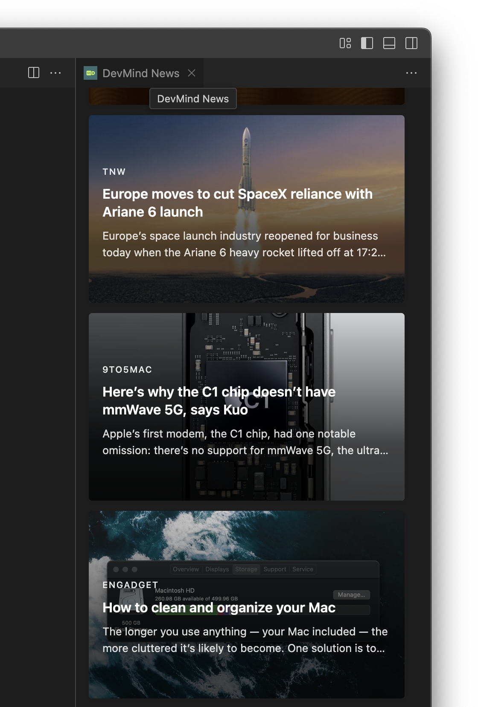

# DevMind

DevMind brings the latest developer news directly to your VS Code status bar. Stay updated with the tech world without leaving your editor!


## News UI in Panel



## What's New in 0.4.0

- **Card-Based UI**: Beautiful card design with news images as backgrounds
- **Improved Layout**: Responsive grid layout for better viewing experience
- **Visual Enhancements**: Gradient overlays and hover effects for better readability
- **RSS Feed Sources**: News from TechCrunch, DEV.to, Hacker Noon, and FreeCodeCamp
- **Performance Improvements**: Faster loading and smoother transitions

## Features

- **Status Bar Integration**: View the latest developer news directly in your VS Code status bar
- **News Rotation**: Automatically rotates through top news items every 10 seconds (pauses on hover)
- **Multiple Sources**: Fetches news from TechCrunch, DEV.to, Hacker Noon, and FreeCodeCamp
- **Rich Content**: View article excerpts in tooltips for quick previews
- **News Panel**: Browse all fetched news items in a dedicated panel
- **One-Click Access**: Open any news item directly in your browser

## Configuration

DevMind can be customized through VS Code settings:

| Setting | Description | Default |
|---------|-------------|---------|
| `devmind.statusBar.maxTitleLength` | Maximum length of news title in status bar | 75 |
| `devmind.statusBar.refreshInterval` | Interval to rotate news in milliseconds | 10000 |
| `devmind.panel.maxWidth` | Maximum width of news panel in pixels | 500 |
| `devmind.news.maxItems` | Maximum number of news items to display | 20 |

## Commands

- `DevMind: Show News Panel` - Opens a dedicated panel with all news items
- `DevMind: Refresh News` - Manually refreshes the news feed
- `DevMind: Open Current News in Browser` - Opens the currently displayed news item in your browser
- `DevMind: Show Next/Previous News` - Navigate through news items

## How it Works

DevMind pulls the latest developer news from multiple sources and displays them in your VS Code status bar. The news items rotate automatically, keeping you updated without being intrusive.

Hover over a news item to see the full title, excerpt, and action buttons.

## Requirements

- Visual Studio Code 1.85.0 or higher
- Internet connection to fetch news

## Upcoming Features

- **Radio Player**: Listen to developer podcasts and music while coding
- Enhanced customization options
- Personalized news preferences

## Release Notes

### 0.4.0

- Implemented magazine-style card design with news images as backgrounds
- Updated news sources to TechCrunch, DEV.to, The Verge, Wired, and Mashable
- Reduced refresh interval to 15 minutes for more timely updates
- Added pause-on-hover functionality for the status bar
- Filtered out news items without images for a more engaging experience

### 0.2.0

- Switched to RSS feeds for more reliable content delivery
- Added article excerpts in tooltips
- Improved performance with refresh intervals
- Enhanced UI for better readability

### 0.1.1

- Fixed command registration for "Show News Panel" in Command Palette
- Minor improvements to command accessibility

### 0.1.0

- Initial release of DevMind

---

## Development

### Building the Extension

```bash
npm run compile
vsce package
```

### Installing the Extension

```bash
code --install-extension devmind-0.1.0.vsix
```

---

**Enjoy!**
